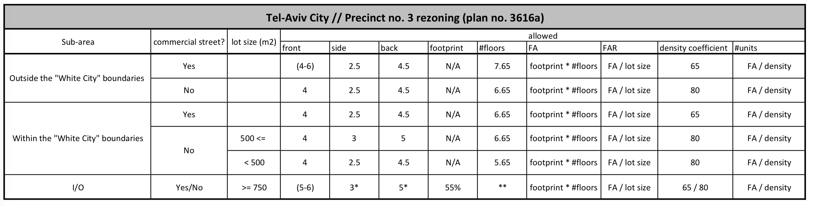

# Tel-Aviv city center Rezoning Evaluation
### Markets, Design and the City class, NYU Wagner Spring 2018
Evaluation of a new zoning ordinance for Tel-Aviv city center; 

## Research objective
This research aims to evaluate the economic feasibility of a new incentive-based ordinance for the city center of Tel-Aviv, precinct 3, analyzed on the parcel level using GIS data. This study also assesses the future floor-area ratio (FAR) to be generated by the rezoning, as well as the number of housing units to be added across the precinct, according to the plan’s anticipated utilization. The analysis showed a significant share of precinct 3 to have no economic justification for utilizing the new ordinance, leaving more than 75% of the precinct’s old buildings to crumble and deteriorate, and changing the well distinguished coherency of the urban scape of the center of Tel-Aviv. This study suggests a new approach of policy evaluation for urban planning, using spatial data at the granularity level of the individual building and big data computational capabilities in order to lever planning and to assure ordinances serve and reflect their objectives. 

## Data
i.	[GIS website of Tel-Aviv](https://gisn.tel-aviv.gov.il/iview2js/index.aspx) 

ii. [Zoning Ordinance no. 3616a documentation](http://mavat.moin.gov.il/MavatPS/Forms/SV4.aspx?tid=4&et=1&PL_ID=ppnCWTcsST9sCXNyHNoQFA4YXrcCUxceDk4O1Xa3nvDP/AwBOUtlpTtKqS6qvAeW1S7GYroEozyrrsmyUB8ulP1psIdjSx3vlcIC1JdQyKE=) _(Hebrew content only)_; The guidlines of the ordinance were arranged in the following table:

## Methodology
The entire analysis and the code was used to generate it are available in an iPython notebook in this GitHub repository: 
https://github.com/danachermesh/Tel-Aviv_RezoningFeasibility/blob/master/Tel-Aviv_RezoningEvaluation.ipynb

This study assumes an equal high demand for land for all precinct 3 area, meaning a full utilization of allowed floor area in every renewal project to be built. 

The research takes into account residential buildings only, and evaluates the economic feasibility of the demolishment + new construction part of ordinance 3616a, excluding building improvements and construction additions possibilities. Parcels designated for historic preservation were excluded from the analysis, being the rezoning not applied to them. Also, new buildings (built after 1980), not eligible for the new ordinance guidelines, were excluded from the analysis as well.

Being this research conducted months only after the rezoning ordinance was approved, its analysis is predictive, using existing physical parameters of the buildings and parcels of precinct 3, and assessing their future characteristics by relying on the new ordinance guidelines.

Feasibility threshold was defined as having a ratio of at most 50%-50% between existing floor area and allowed floor area according to the new ordinance, this due to the obligation of the developer to give back to the dwellers the existing floor area within the new construction. Big parcels (750m2 or bigger) and small parcels (500m2 or smaller) allow / require ratio of 55% in the favor of the dwellers or the developer, respectively.

## Conclusions and Implications 
The analysis showed a significant share of more than 75% of precinct 3 to have no economic justification for utilizing the new ordinance, practically meaning leaving this meaningful precinct to deteriorate. 

These results raise questions regarding the objectives of the new ordinance and whether the plan actually directs the city and its urban realm towards them. Will the plan’s guidelines truly preserve the quality of the landscape of the city center of Tel-Aviv? And is the plan a real lever for urban renewal, considering its incentives are profitable enough for utilization of only less than a quarter of the precinct’s buildings? These two questions, leading and motivating this study, should inform the local planners and make them reassess this plan and the future ordinances that are under different planning phases these days in Tel-Aviv. 

Also, this research should raise a discourse regarding master plans and policy analysis, and the way big data tools and techniques can be applied to urban planning, leveraging it by allowing qualitative and granular spatial analysis. 
